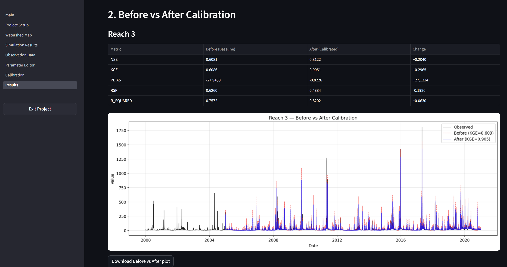
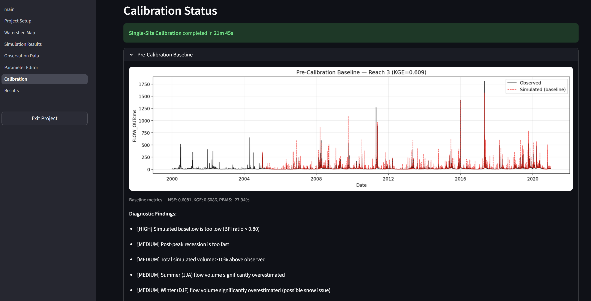
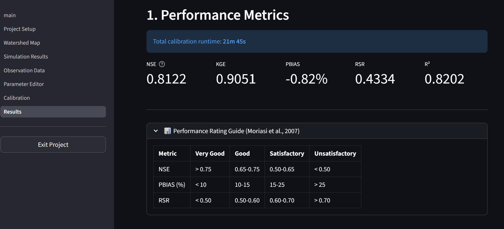
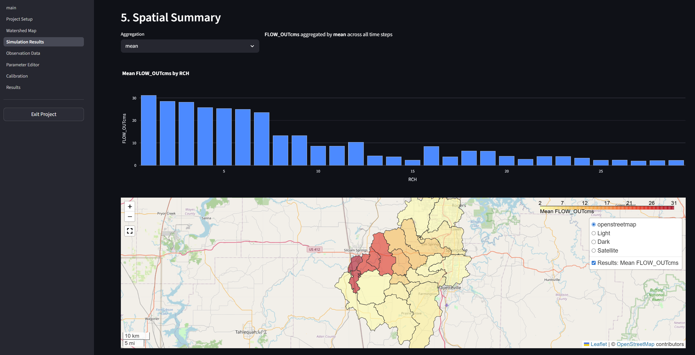
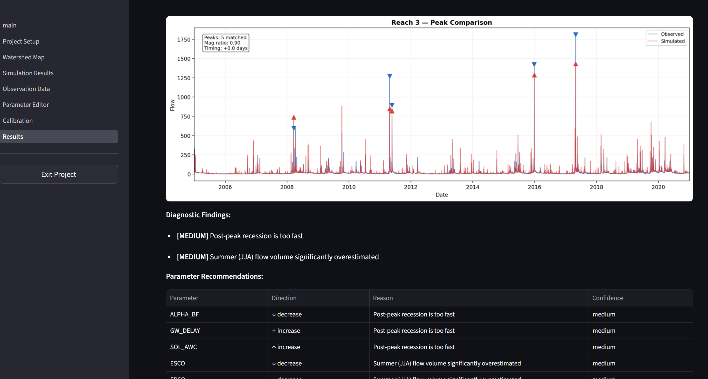
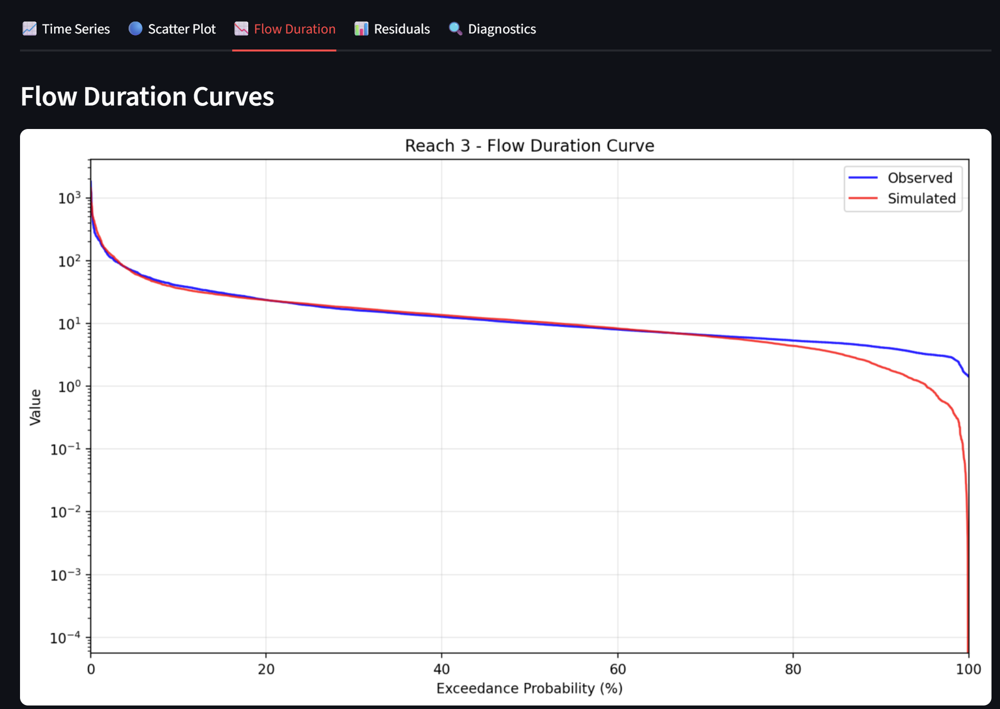

# SWAT-DG: Diagnostic-Guided SWAT Calibration

[](https://www.python.org/downloads/)
[](https://opensource.org/licenses/Apache-2.0)
[](https://github.com/psf/black)

Python framework for the SWAT2012 hydrological model (Rev. 681+) with **diagnostic-guided calibration** — physics-based parameter tuning that converges in minutes, not days.
Developed by [Lynxce](https://www.lynxce-env.com/) | [Download Portable ZIP](https://github.com/wasailin/SWAT-DG/releases)

---

## The Problem: Calibration is a Bottleneck

SWAT has more than 45 adjustable parameters. Standard calibration tools try thousands of parameter combinations blindly — like tuning a complex instrument while blindfolded. The popular SCE-UA algorithm (used in SWAT-CUP) typically requires **5,000 to 50,000 model runs** to converge. At one minute per run, that's **3 to 35 days** of compute time.

Worse, blind optimization tells you *what* the best parameters are — but not *why* they work. When the model fails in a new scenario, you start over from scratch.

## The Solution: Diagnose Before You Calibrate

SWAT-DG acts like an experienced hydrologist reading the hydrograph. Before touching any parameters, it runs **5 diagnostic checks** on simulated vs. observed streamflow:

1. **Volume balance** — Is total simulated water too high or too low?
2. **Baseflow partition** — Is the groundwater/surface runoff split correct?
3. **Peak events** — Are storm peaks the right magnitude and timing?
4. **Flow duration curve** — Does the model reproduce wet, median, and dry flow statistics?
5. **KGE decomposition** — Is poor performance from timing, variability, or bias?

These diagnostics feed **14 expert rules** that prescribe targeted parameter adjustments in 4 sequential phases. The result:

| Method | Runs Needed | Time (1 min/run) |
|--------|-------------|-------------------|
| Monte Carlo | 1,000–10,000 | 17–167 hours |
| SCE-UA (SWAT-CUP) | 5,000–50,000 | 83–833 hours |
| **SWAT-DG Diagnostic** | **5–50** | **5–50 minutes** |

> SWAT-DG is a rapid screening tool and smart warm-start. For publication-quality calibration, run SWAT-DG first to get a physically informed starting point, then refine with SCE-UA — cutting total iterations by 30–60%.



---

## Web Interface — No Code Required

SWAT-DG includes a **7-page Streamlit web app** that runs 100% locally. All data stays on your computer. A portable Windows ZIP is available — no Python installation needed.

<p align="center">
  
  
  
</p>

**App pages:**
- **Project Setup** — Load SWAT project, auto-detect executable, view project info
- **Watershed Map** — Interactive Folium map of subbasins and reaches with simulation output overlay
- **Simulation Results** — Browse raw SWAT outputs, compare runs, spatial summaries
- **Observation Data** — Import from USGS NWIS API, CSV, Excel, WQP/STORET with auto unit conversion
- **Parameter Editor** — Edit 45+ parameters with live bounds, batch editing, save/load presets
- **Calibration** — Choose mode (single-site, multi-site, sequential, partial-basin), algorithm, and run
- **Results** — Performance metrics, before/after hydrographs, scatter plots, FDC, diagnostic plots, export

<p align="center">
  
  
</p>

---

## Key Features

- **Diagnostic-Guided Calibration** — Single diagnostic, ensemble (parallel runs for uncertainty), phased (hydrology → sediment → nitrogen → phosphorus), multi-constituent water quality calibration with load calculator and WQ-specific diagnostic engines

- **Traditional Calibration (SPOTPY)** — 8+ algorithms (SCE-UA, DREAM, Monte Carlo, LHS, ROPE, DE-MCZ), 45+ parameters with recommended bounds, 8 objective functions (NSE, KGE, PBIAS, RMSE, MAE, R², RSR, Log-NSE), sensitivity analysis (FAST, Sobol), multi-site and sequential calibration, parallel multi-core support

- **Complete Python SWAT Wrapper** — Run simulations, read/write all input files (.bsn, .sol, .mgt, .gw, .cio), parse all outputs to DataFrames, backup/restore with 99.9% size reduction, fig.fig routing parser with upstream/downstream traversal, partial-basin active subbasin optimization

- **Rich Visualization** — Hydrographs (daily/monthly), scatter plots, flow duration curves, diagnostic plots (baseflow separation, peak comparison, seasonal bias, rating curves), interactive Plotly charts, sensitivity tornado charts, export to PNG/PDF/HTML

- **Data Automation** — USGS NWIS streamflow/WQ import, Water Quality Portal (WQP/STORET) with auto unit conversion, NOAA CDO weather data, SSURGO soil data, NLCD land cover, DEM processing and watershed delineation

## Installation

```bash
pip install swat-dg
```

Or install from source:

```bash
git clone https://github.com/wasailin/SWAT-DG.git
cd swat-dg
pip install -e .
```

For calibration features:
```bash
pip install swat-dg[calibration]  # Installs spotpy, pathos
```

For GIS/spatial features:
```bash
pip install swat-dg[gis]  # Installs geopandas, rasterio, pyproj, xarray, folium
```

For data automation:
```bash
pip install swat-dg[data]  # Installs requests, openpyxl
```

For the Streamlit web app:
```bash
pip install swat-dg[app]  # Installs streamlit, plotly, folium
```

For all features:
```bash
pip install swat-dg[full]  # All above + scipy, shapely
```

## Quick Start

### Launch the Calibration App (Easiest!)

```bash
# Install with app dependencies
pip install -e ".[app]"

# Launch the calibration app
streamlit run src/swat_modern/app/main.py

# Opens browser at http://localhost:8501
# Browse to your SWAT project folder
# Load observation data, select parameters, run calibration!
```

The app runs **100% locally** - all data stays on your computer.

### Basic Usage

```python
from swat_modern import SWATModel

# Load a SWAT project
model = SWATModel("C:/my_watershed", executable="C:/swat2012.exe")

# Run simulation
result = model.run()

# Get streamflow output
flow = model.get_output("FLOW_OUTcms", output_type="rch", unit_id=1)
print(flow.head())

# Modify parameters
model.modify_parameter("CN2", -0.1, method="multiply")  # Reduce CN2 by 10%

# Run again
result2 = model.run()
```

### Calibration

```python
from swat_modern import SWATModel
from swat_modern.calibration import Calibrator

# Load model
model = SWATModel("C:/my_watershed")

# Create calibrator with observed data
calibrator = Calibrator(
    model=model,
    observed_data="streamflow.csv",
    parameters=["CN2", "ESCO", "GW_DELAY", "ALPHA_BF", "GWQMN"],
    output_variable="FLOW_OUT",
    reach_id=1,
    objective="nse"
)

# Run automatic calibration (parallel across cores)
results = calibrator.auto_calibrate(
    n_iterations=5000,
    algorithm="sceua",
    parallel=True,
    n_cores=4
)

# View results
results.print_summary()
results.plot_comparison()

# Save best parameters
results.save_best_parameters("best_params.json")
```

### Diagnostic-Guided Calibration

```python
from swat_modern.calibration import Calibrator

calibrator = Calibrator(model=model, observed_data="streamflow.csv", reach_id=1)

# Single diagnostic run (uses flow signatures to guide parameter selection)
result = calibrator.diagnostic_calibrate(n_iterations=2000)

# Ensemble diagnostic (multiple runs for uncertainty)
result = calibrator.ensemble_diagnostic_calibrate(n_ensemble=5, n_iterations=1000)

# Phased: hydrology first, then sediment, then nitrogen, then phosphorus
result = calibrator.phased_calibrate(phases=["hydrology", "sediment", "nitrogen", "phosphorus"])
```

### Sensitivity Analysis

```python
from swat_modern.calibration import Calibrator

calibrator = Calibrator(model=model, observed_data="streamflow.csv", reach_id=1)

# Parallel sensitivity analysis
sa_result = calibrator.sensitivity_analysis(
    method="fast",
    n_samples=500,
    parallel=True,
    n_cores=4
)

sa_result.plot_rankings()
print(sa_result.top_parameters(n=10))
```

### Using Objective Functions

```python
from swat_modern.calibration.objectives import nse, kge, pbias, rsr, evaluate_model

# Calculate single metric
score = nse(observed, simulated)
print(f"NSE = {score:.3f}")

# Calculate multiple metrics
metrics = evaluate_model(observed, simulated)
print(metrics)  # {'nse': 0.85, 'kge': 0.78, 'pbias': 5.2, 'rsr': 0.45, ...}
```

### Visualization Dashboard

```python
from swat_modern.visualization import CalibrationDashboard

dashboard = CalibrationDashboard(
    dates=dates,
    observed=observed,
    simulated=simulated,
    site_name="Big Creek Watershed",
    variable_name="Streamflow",
    units="m³/s"
)

dashboard.create_dashboard()
dashboard.save("calibration_report.png")
dashboard.to_html("calibration_report.html")
```

## Requirements

- Python 3.10+
- numpy, pandas, matplotlib
- SWAT2012 executable, Rev. 681 or above (available from [Releases](https://github.com/wasailin/SWAT-DG/releases) or the [official SWAT website](https://swat.tamu.edu/))

## Documentation

See the `docs/` folder:
- [Quick Start](docs/quickstart.md)
- [Installation](docs/installation.md)
- [API Reference](docs/api_reference.md)
- [User Manual](docs/user_manual.md)

<details>
<summary><strong>Calibration Parameters (45+)</strong></summary>

| Group | Parameters |
|-------|------------|
| Hydrology | CN2, ESCO, EPCO, SURLAG, OV_N, CANMX |
| Groundwater | GW_DELAY, ALPHA_BF, ALPHA_BF_D, GWQMN, REVAPMN, GW_REVAP, RCHRG_DP |
| Soil | SOL_AWC, SOL_K, SOL_BD |
| Routing | CH_N2, CH_K2 |
| Sediment | USLE_P, USLE_K, SPCON, SPEXP, CH_COV1, CH_COV2, PRF, ADJ_PKR |
| Nutrients | NPERCO, PPERCO, CMN, PSP, N_UPDIS, PHOSKD, ERORGP, and more |

</details>

<details>
<summary><strong>Calibration Algorithms</strong></summary>

Via SPOTPY integration:

- **SCE-UA** - Shuffled Complex Evolution (recommended for hydrology)
- **DREAM** - Differential Evolution Adaptive Metropolis (with uncertainty)
- **MC** - Monte Carlo sampling (fully parallelizable)
- **LHS** - Latin Hypercube Sampling (fully parallelizable)
- **ROPE** - Robust Parameter Estimation
- **DE-MCZ** - Differential Evolution MCMC

Diagnostic-guided (built-in):

- **diagnostic** - Physics-based single diagnostic run
- **diagnostic_ensemble** - Multiple diagnostic runs with uncertainty
- **phased** - Sequential hydrology → sediment → nitrogen → phosphorus

</details>

<details>
<summary><strong>Project Status (v0.5.0)</strong></summary>

### Phase 1: Python Wrapper Foundation ✅
- [x] Basic SWAT model wrapper (`SWATModel`)
- [x] Output file parsing (output.rch, output.sub, output.hru, output.std, output.rsv)
- [x] Input file parsing (.bsn, .sol, .mgt, .gw, .cio, fig.fig)
- [x] Parameter modification (replace, multiply, add methods)
- [x] Project backup/restore (selective file types for 99.9% size reduction)

### Phase 2: Calibration Automation ✅
- [x] SPOTPY calibration integration (8+ algorithms)
- [x] Objective functions (NSE, KGE, PBIAS, RMSE, MAE, R², Log-NSE, RSR)
- [x] 45+ calibration parameter definitions with recommended bounds
- [x] Sensitivity analysis (FAST, Sobol) with parallel support
- [x] Multi-site calibration (simultaneous and sequential upstream-to-downstream)
- [x] Parameter boundary manager for custom search bounds

### Phase 3: Input Data Automation ✅
- [x] Weather data retrieval (NOAA API)
- [x] SWAT weather file generation (.pcp, .tmp, WGEN)
- [x] Soil data processing (SSURGO integration)
- [x] Land cover (NLCD classification)
- [x] DEM processing and watershed delineation
- [x] USGS NWIS observation data import (streamflow and water quality)
- [x] Multi-format observation loader (CSV, Excel, USGS RDB, WQP/STORET)

### Phase 4: User Interface ✅
- [x] Visualization dashboard (hydrograph, scatter, duration curves, metrics table)
- [x] Diagnostic visualization (baseflow separation, peak comparison, seasonal bias, rating curves)
- [x] Interactive Plotly charts (time series, multi-variable, scatter)
- [x] Streamlit web app (7 pages) with session persistence
- [x] Interactive parameter selection and boundary editing
- [x] Export to JSON, CSV, HTML, PNG, PDF

### Phase 5: Advanced Calibration ✅
- [x] Diagnostic-guided calibration (baseflow separation, peak analysis, volume balance, FDC metrics)
- [x] Ensemble diagnostic calibration with uncertainty
- [x] Phased calibration (hydrology → sediment → nitrogen → phosphorus)
- [x] Parallel multi-core calibration via pathos
- [x] Multi-constituent WQ calibration (sediment, nitrogen, phosphorus)
- [x] Load calculator for constituent loads
- [x] WQ-specific diagnostic engines

### Phase 6: Distribution & Performance ✅
- [x] SWAT+ to SWAT2012 converter (CLI and API)
- [x] fig.fig routing parser with upstream/downstream traversal
- [x] Partial-basin active subbasin optimization (active_subs.dat)
- [x] Portable SWAT-DG Windows package (embedded Python 3.11, no install needed)
- [x] Intel ifx compiler build (2.4x faster than gfortran)
- [x] GIS integration (Folium maps, shapefile loading)

</details>

## Contributing

Contributions are welcome! Please see our contributing guidelines.

## License

Apache 2.0 License - see LICENSE file for details.

## Acknowledgments

This project builds on the SWAT model developed at Texas A&M University.
See https://swat.tamu.edu/ for more information about SWAT.

## References

- Arnold, J.G., et al. (2012). SWAT: Model Use, Calibration, and Validation. ASABE.
- Abbaspour, K.C. (2015). SWAT-CUP: SWAT Calibration and Uncertainty Programs.
- Moriasi, D.N., et al. (2007). Model evaluation guidelines. ASABE, 50(3), 885-900.
